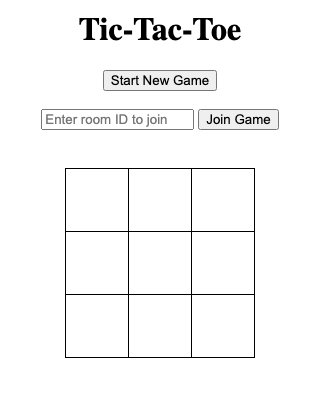

# Tic-Tac-Toe Game

This is a real-time Tic-Tac-Toe game implemented using Flask, Flask-SocketIO, and JavaScript. The game allows two players to play Tic-Tac-Toe in real time, with each player joining a unique game room.



## Project Structure

The project is structured into the following files:

- `app.py`: The main Flask application that sets up routes and handles SocketIO events.
- `game.py`: Contains the game logic and game management classes.
- `socket_events.py`: Handles SocketIO events for joining games and making moves.
- `templates/index.html`: The HTML file for the game interface.
- `static/script.js`: The JavaScript file that handles client-side SocketIO communication and user interactions.

## Entities

### Game

The `Game` class represents a Tic-Tac-Toe game and contains the following attributes:

- `board`: A 3x3 list representing the game board.
- `turn`: A string representing the current player's turn ('X' or 'O').
- `players`: A list of players in the game.

The `Game` class has methods to:

- `check_winner()`: Check if there is a winner.
- `reset()`: Reset the game board and turn.
- `add_player(player)`: Add a player to the game.

### GameManager

The `GameManager` class manages multiple game rooms and contains the following attributes:

- `games`: A dictionary mapping room IDs to game instances and their creation time.
- `room_expiry_duration`: The duration after which a game room expires.

The `GameManager` class has methods to:

- `create_game()`: Create a new game room and return its ID.
- `get_game(room)`: Get the game instance for a given room ID.
- `reset_game(room)`: Reset the game for a given room ID.
- `cleanup_expired_games()`: Remove expired game rooms.

## Basic Flow

1. **Starting a New Game**
   - The player clicks "Start New Game."
   - The client sends a `join` event with action `start`.
   - The server creates a new game room and assigns the player as 'X'.
   - The client joins the new room and displays the room ID.

2. **Joining an Existing Game**
   - The player enters a room ID and clicks "Join Game."
   - The client sends a `join` event with action `join` and the room ID.
   - The server checks if the room exists and assigns the player as 'O'.
   - The client joins the existing room and updates the game state.

3. **Making a Move**
   - The player clicks on a cell on the board.
   - The client sends a `move` event with the room ID, row, column, and player.
   - The server updates the board if the move is valid and checks for a winner.
   - The server broadcasts the updated board state to all clients in the room.

## Checking for the Win Condition

The win condition is checked after each move using the `check_winner()` method in the `Game` class. The method checks the following conditions:

1. **Rows**: If all cells in a row are the same and not `None`.
2. **Columns**: If all cells in a column are the same and not `None`.
3. **Diagonals**: If all cells in either diagonal are the same and not `None`.

If any of these conditions are met, the method returns the winning player ('X' or 'O'). If no winner is found, it returns `None`.

## Running the Application

To run the application, follow these steps:

1. Install the required packages:
   ```bash
   pip install flask flask-socketio
   ```

2. Start the Flask server:
   ```bash
   python app.py
   ```

3. Open a web browser and go to `http://localhost:5454` to play the game.
